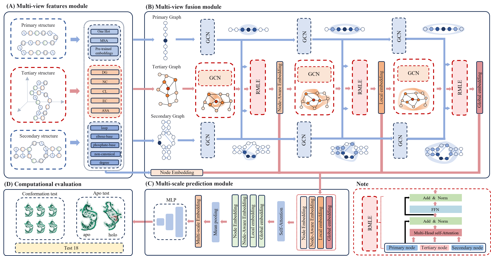

# 🌟 MVRBind

## **MVRBind: Multi-view Learning for RNA-Small Molecule Binding Site Prediction**

🔬 We introduce **MVRBind**, a **multi-view graph convolutional network** for predicting RNA-small molecule binding sites. It builds structural representations at three levels:

* 🧬 **Primary Structure**
* 🏗 **Secondary Structure**
* 📦 **Tertiary Structure**

✨ **Key Innovations:**

* ✅ Multi-view fusion of distinct RNA features
* ✅ Cross-view integration of multi-scale representations
* ✅ Outperforms baselines across experiments
* ✅ Accurate on both **holo** and **apo** RNA forms
* ✅ Robust across diverse RNA conformations

> MVRBind advances RNA-targeted drug discovery by improving binding site prediction accuracy. 🚀



---

## 📁 Project Structure

```
├── data_process/            # Scripts for data preprocessing
├── model_parameters/        # Trained model parameter files
├── pt/                      # Data files
├── model.py                 # Model definition
├── predict.py               # Prediction script
├── predict_binding_site.py  # Predict on your own dataset
├── train.py                 # Training script
├── environment.yml          # Conda environment
├── setup_windows.bat        # Setup for Windows
├── setup_linux.sh           # Setup for Linux
```

---

## ⚙️ Installation Guide

> ✅ Choose **one** of the following setup methods:

### 🪟 Windows

```bash
git clone https://github.com/cschen-y/MVRBind
cd MVRBind
setup_windows.bat
conda activate MVRBind
```

### 🐧 Linux

```bash
git clone https://github.com/cschen-y/MVRBind
cd MVRBind
chmod +x setup_linux.sh
./setup_linux.sh
conda activate MVRBind
```

### 🔧 Using environment.yml

```bash
git clone https://github.com/cschen-y/MVRBind
cd MVRBind
conda env create -f environment.yml
conda activate MVRBind
```

---

## 🚀 Data Preprocessing Pipeline (Example: `2JUKA`)

### 🧬 Step 1: Download and Process PDB to FASTA

* Input: `2JUKA` (PDB ID: 2JUK, Chain: A)
* Actions:

  * Download PDB
  * Extract chain A
  * Clean structure (remove water, ions, non-RNA residues)
  * Convert to FASTA
* Output:

  * `./data/pdb/2JUKA.pdb`
  * `./data/fasta/2JUKA.fasta`

```bash
cd data_process
python ./get_pdb.py --pdb_id_chain 2JUKA --pdb_dir ./data/pdb
```

---

### 🧬 Step 2: MSA & Conservation Scoring

* Perform multiple sequence alignment (MSA) using **ClustalW**
* Output:

  * `./data/msa/`
  * `./data/aligned/` 

```bash
chmod +x ../clustalw/clustalw2
python  ./msa_score.py \
  --clustalw ../clustalw/clustalw2 \
  --fasta ./data/fasta \
  --msa_out ./data/msa \
  --aligned_out ./data/aligned
```

> 🔹 `--clustalw`: The path to the ClustalW executable
> 🔹 `--fasta`: Input folder with `.fasta` files
> 🔹 `--msa_out`: Saves intermediate `.aln` alignments
> 🔹 `--aligned_out`: Saves conservation score outputs

---

### 🧬 Step 3: Get RNA Secondary Structure from RNApdbee

* Go to: [http://rnapdbee.cs.put.poznan.pl/](http://rnapdbee.cs.put.poznan.pl/)
* Input: PDB ID `2JUK`, Chain A
* Submit and wait for results
* After job finishes:

  1. **Download all output files**
  2. **Unzip the package**
  3. Move to:

```
data_process/data/secondary_structure/2JUKA/
```

---

### 🧬 Step 4: Obtain RNA Embeddings & SASA Features

#### 4.1 RNABERT Embeddings

* Repo: [https://github.com/mana438/RNABERT](https://github.com/mana438/RNABERT)
* Generate embeddings from RNA sequences
* Place the generated result file in the following directory:

```
data_process/data/em/2JUKA_output.txt
```

> 📄 **Naming format**: `{pdb_id_chain}_output.txt`

---

#### 4.2 RNAsnap2 SASA Features

* Repo: [https://github.com/jaswindersingh2/RNAsnap2](https://github.com/jaswindersingh2/RNAsnap2)
* Compute solvent accessible surface area (SASA)
* Place the generated result file in the following directory:

```
data_process/data/em/2JUKA.rnasnap2_single
```

> 📄 **Naming format**: `{pdb_id_chain}.rnasnap2_single`


---

## 🎯 Final Step: Predict RNA Binding Sites

After preparing all input features (FASTA, MSA, embeddings, SASA, structure), you can run the prediction script.

👉 **We have already preprocessed the features for `2JUKA` as an example**, so you can directly run the following command to test the pipeline:

```bash
cd ..
python predict_binding_site.py \
  --root ./pt/2JUKA_pt \
  --pdb ./data_process/data/pdb \
  --fasta ./data_process/data/fasta \
  --msa ./data_process/data/aligned \
  --em ./data_process/data/em \
  --asa ./data_process/data/asa
```

### 📌 Argument Descriptions:

* `--root`: Path to the folder where data will be saved
* `--pdb`: Folder containing cleaned `.pdb` structures (from Step 1)
* `--fasta`: Folder containing `.fasta` sequences (from Step 1)
* `--msa`: Folder with MSA alignment + conservation score outputs (from Step 2)
* `--em`: Folder with RNABERT embedding files (from Step 4.1)
* `--asa`: Folder with RNAsnap2 SASA files (from Step 4.2)

### 🧾 Example Output

Running the above command for **`2JUKA`**  produce an output like this:

```text
>2JUKA
GGCCUUCCCACAAGGGAAGGCC
predict binding sites: [0, 0, 0, 0, 1, 1, 1, 0, 1, 1, 1, 1, 0, 0, 0, 1, 1, 1, 0, 0, 0, 0]
```

#### 📖 Explanation:

* The **sequence** `GGCCUUCCCACAAGGGAAGGCC` is the RNA chain in FASTA format.
* The list `predict binding sites` contains binary values:
  * `1` indicates that the corresponding nucleotide is predicted to be a **ligand binding site**.
  * `0` means it is **not** predicted to be a binding site.
* Here, ">2JUKA" is the header where "2JUK" refers to the PDB ID of the RNA structure, and "A" indicates chain A of this structure. The RNA sequence follows, and the list of 0s and 1s corresponds one-to-one to each residue in the sequence. In this list, 1 indicates the residue is predicted to be a binding site, while 0 means it is predicted to be a non-binding residue. For example, the fifth residue "U" in the sequence corresponds to the fifth value "1" in the list, meaning this residue is predicted to participate in binding.

---

