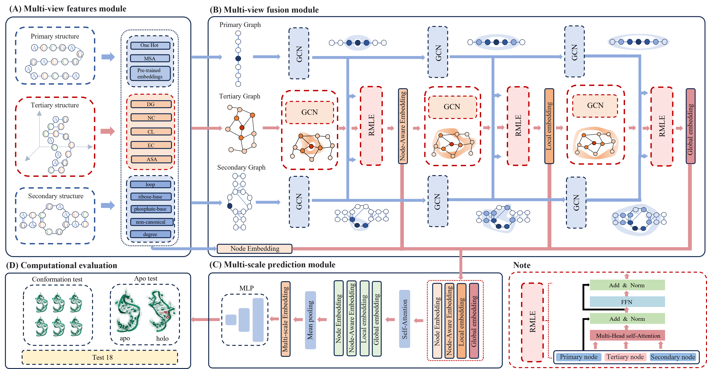

# 🌟 MVRBind

## **MVRBind: Multi-view Learning for RNA-Small Molecule Binding Site Prediction**

🔬 In this study, we introduce **MVRBind**, a **multi-view graph convolutional network** designed to predict RNA-small molecule binding sites. MVRBind constructs feature representations at three structural levels:

- 🧬 **Primary Structure**
- 🏗 **Secondary Structure**
- 📦 **Tertiary Structure**

✨ **Key Innovations:**
✅ A **multi-view fusion module** that learns distinct RNA structural features.
✅ **Cross-view feature fusion**, enabling integration of multi-scale representations.
✅ **Consistently outperforms baseline methods** across different experimental setups.
✅ **Accurate predictions** for RNA binding sites in both **holo and apo forms**.
✅ **Robust performance** across diverse RNA conformations.

These advancements position MVRBind as a powerful tool for **RNA-targeted drug discovery**, significantly enhancing the accuracy and reliability of binding site predictions. 🚀



---

## 📁 Project Structure

The project is organized as follows:

```
├── data_process/          # Scripts for data preprocessing
├── model_parameters/      # Trained model parameter files
├── pt/                    # Data files
├── model.py               # Model definition script
├── predict.py             # Prediction script
├── train.py               # Model training script
├── environment.yml        # Dependency list
├── setup_windows.bat      # Batch script for setting up dependencies on Windows
├── setup_linux.bat        # Batch script for setting up dependencies on Linux
```

---

## ⚙️ Installation Guide

### 🧭 Step-by-Step Setup

> ✅ Choose **only ONE** of the following three installation methods based on your system or preference.

---

### 🪟 Method 1: Windows (via `setup_windows.bat`)

```bash
# 1. Clone the repository
git clone https://github.com/cschen-y/MVRBind
cd MVRBind

# 2. Run the setup script
setup_windows.bat

# 3. Activate environment
conda activate MVRBind
```

---

### 🐧 Method 2: Linux (via `setup_linux.sh`)

```bash
# 1. Clone the repository
git clone https://github.com/cschen-y/MVRBind
cd MVRBind

# 2. Make script executable and run
chmod +x setup_linux.sh
./setup_linux.sh

# 3. Activate environment
conda activate MVRBind
```

---

### 🔧 Method 3: Install via `environment.yml`

```bash
# 1. Clone the repository
git clone https://github.com/cschen-y/MVRBind
cd MVRBind

# 2. Create and activate environment
conda env create -f environment.yml
conda activate MVRBind
```

---


## 🚀 Usage

### 🔥 Model Training

Train the model using the following command:

```bash
python train.py
```

📝 Trained model parameters will be saved in the `model_parameters/` directory.

#### 📊 示例训练日志输出：

```
Epoch 1: LR = 0.001000, Train Loss = 0.7680, Val Loss = 0.6856, MCC = 0.0000
Epoch 2: LR = 0.001000, Train Loss = 0.7389, Val Loss = 0.6848, MCC = 0.0000
Epoch 3: LR = 0.001000, Train Loss = 0.7048, Val Loss = 0.6848, MCC = 0.0000
Epoch 4: LR = 0.001000, Train Loss = 0.6944, Val Loss = 0.6826, MCC = 0.0000
Epoch 5: LR = 0.001000, Train Loss = 0.6737, Val Loss = 0.6753, MCC = 0.0000
Epoch 6: LR = 0.001000, Train Loss = 0.6467, Val Loss = 0.6698, MCC = 0.0389
Epoch 7: LR = 0.001000, Train Loss = 0.6451, Val Loss = 0.6640, MCC = 0.0410
Epoch 8: LR = 0.001000, Train Loss = 0.6300, Val Loss = 0.6581, MCC = 0.0544
Epoch 9: LR = 0.001000, Train Loss = 0.6153, Val Loss = 0.6525, MCC = 0.0224
```

### 🎯 Model Prediction

Use the trained model to make predictions:

```bash
python predict.py
```

#### ✅ 示例测试输出：

```
Test18 inference time: 0.0683s, Avg/sample: 0.000112s  
Test18: Accuracy: 0.7131  
        Precision: 0.6509  
        Recall: 0.3333  
        F1 Score: 0.4409  
        MCC: 0.3018  
        ROC AUC: 0.7559
```

